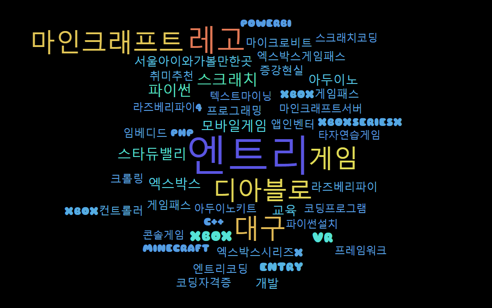

# naverHashTagSelector
> 해달에듀에 필요한 네이버 해시태그 선택기

네이버블로그를 작성하는데 필요한 해시태그를 선택해 추천해주는 프로그램을 정리하자  

## 앵커링 키워드
* `엔트리` `로블록스` `마인크래프트` `스크래치` `마이크로비트` 
* `파이썬` `코딩` `로봇` `키즈` `어린이` 
* `현장체험` `정보` `수학` `과학` `초등` 
* `학원` `교육` `교과서` `디지털` `교육과정` 
* `코딩파티` `온라인코딩파티`

### 해시태그 분류
* `comEdu` 코딩의무교육 키워드 - 10개
* `comSkillUp` 코딩평생교육 키워드 - 2개
* `parent` 학부모가 검색하는 인기키워드 - 5개
* `education` 교육정책 키워드 - 2개
* `haedalEss` 해달에듀 어필 필수 키워드 - 3개
* `haedalIf` 해달에듀 어필 선택 키워드 - 2개
* `etc` 기타 - 2개
총 26개

### 네이버 해시태그 선택기
[프로그램 바로가기](naverHashTagSelector.py)